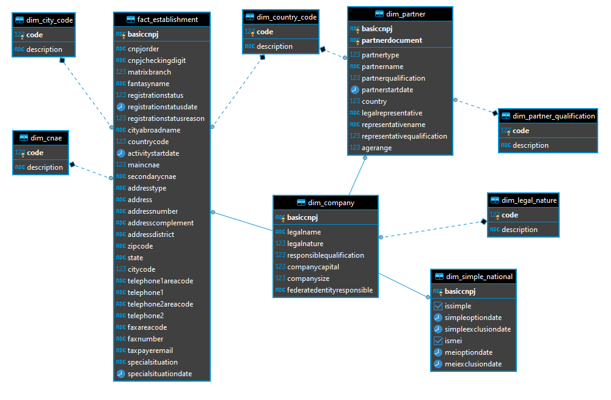

# Open data from Brasil

Leia em outro idioma (Read this in other language):

[](README-en-US.md)
[](README.md)

## Summary

This project was made to explore the Brazil open data about companies.

This project followed the following steps:

1. Define project scope and collect data
2. Explore and evaluate the data
3. Define the data model
4. Run ETL to model the data
5. Describe and document the Project


## 1. Definition of project scope and data collection

### __Project scope__

This project's ultimate goal is to allow people to make analyzes related to Brazilian companies and provide a basis for decision-making, based on competition and other observed factors, such as:

- In which city is a good place to start a business?
- Who are the customers (companies or people who are partners of any company), cities or regions where it is possible to operate or offer services and products?
- How big is the market available?
- Who are my customers, what companies do they own, is there any contact information available?
- Do I have a different approach for some clients due to the existence of a connection (society) between clients?

## 2. Explore and evaluate the data

### __Description of data sets__

The datasets used initially come from the Brazilian government and are made available openly.

__CNPJ Open Data__


**Feature**|**Description**|**Status**
-----|:-----:|:-----:
Periodicidade atualização:|mensal
Formato dados:|csv
Origem:|[clique aqui](https://www.gov.br/receitafederal/pt-br/assuntos/orientacao-tributaria/cadastros/consultas/dados-publicos-cnpj)|
Layout:|[clique aqui](https://www.gov.br/receitafederal/pt-br/assuntos/orientacao-tributaria/cadastros/consultas/arquivos/NOVOLAYOUTDOSDADOSABERTOSDOCNPJ.pdf)

</br>

Arquivos e exemplos:

__Establishments__


[Field Dictionary](./assets/docs/database/dictionary-en-US.md#estabelecimentos)

</br>

__Companies__


[Field Dictionary](./assets/docs/database/dictionary-en-US.md#empresas)

</br>

__Partners__


[Field Dictionary](./assets/docs/database/dictionary-en-US.md#sócios)

</br>

__CNAE - National Classification of Economic Activities__


[Field Dictionary](./assets/docs/database/dictionary-en-US.md#cnae---classificação-nacional-de-atividades-econômicas)

_Agency responsible for this classification:_ [concla](https://concla.ibge.gov.br)

</br>

__Legal Nature__


[Field Dictionary](./assets/docs/database/dictionary-en-US.md#natureza-jurídica)

_Agency responsible for this classification:_ [concla](https://concla.ibge.gov.br)

</br>

__Member Qualification__


[Field Dictionary](./assets/docs/database/dictionary-en-US.md#qualificação-do-sócio)

</br>

__City Code__


[Field Dictionary](./assets/docs/database/dictionary-en-US.md#código-do-município)

</br>

__Country code__


[Field Dictionary](./assets/docs/database/dictionary-en-US.md#código-do-país)

</br>

__Data from the National Simple__


[Field Dictionary](./assets/docs/database/dictionary-en-US.md#dados-do-simples-nacional)

</br>


__Reason for Registration Status__

https://receita.economia.gov.br/orientacao/tributaria/cadastros/cadastro-nacional-de-pessoas-juridicas-cnpj/DominiosMotivoSituaoCadastral.csv/view

__Comments__

1. The field (CNPJ/CPF OF THE PARTNER) and (CNPJ/CPF OF THE REPRESENTATIVE) of the layout of partners must be uncharacterized according to the rule below:

- Concealment of confidential personal information as in the case of the CPF, which must be uncharacterized by hiding the first three digits and the two verification digits, as provided for in art. 129 § 2 of Law No. 13.473/2017 (LDO
2018).

2. Responsible Federative Entity Field - EFR, in the Main Layout (Registration Data):

It must be completed for the cases of Bodies and Entities of the 1XX Legal Nature group. For other natures, this attribute is blank.

Examples of text that should appear in the final file:

- UNION;
- FEDERAL DISTRICT;
- BAHIA;

for municipalities, also display the acronym of the UF:

- SAO PAULO-SP;
- BELO HORIZONTE – MG;

3. Age Range field, in the Members Layout

Based on the date of birth of the CPF of each partner, the value for the Age group field must be created according to the rule below:

- 1 for the intervals between 0 and 12 years;
- 2 for the intervals between 13 and 20 years;
- 3 for the intervals between 21 and 30 years;
- 4 for the intervals between 31 and 40 years;
- 5 for the intervals between 41 and 50 years;
- 6 for the intervals between 51 and 60 years;
- 7 for the intervals between 61 and 70 years;
- 8 for the intervals between 71 and 80 years;
- 9 for people over 80 years old;
- 0 for not applicable;

4. The CNAE FISCAL SECONDARY Field, in the Establishments Layout:

It must be filled in with each occurrence being separated by a comma, for cases of multiple occurrences.

</br>

### __Known Data Issues and How to Address__
<br/>

__Archive:__ K3241.K03200Y0.D10410.ESTABELE

__Field:__ Date registration status

__Value:__ 0

__Problema:__ Invalid format

```txt
"30005475";"0001";"31";"1";"";"2";"0";"0";"";"";"20180322";"6204000";"6209100,7490104";"AVENIDA";"PAULISTA";"2202";"CONJ  54-B";"BELA VISTA";"01310300";"SP";"7107";"11";"59085410";"";"";"";"";"CEFISCO@UOL.COM.BR";"";""
```

__Archive:__ 

__Field:__ Date registration status

__Value:__ 4100813

__Problema:__ Invalid format

```txt
"18825426";"0001";"40";"1";"ALAMBIQUE SANTO ANTONIO";"8";"20150209";"73";"";"";"4100813";"5611204";"";"RUA";"DEOLINDO PERIM";"79";"";"ITAPUA";"29101811";"ES";"5703";"27";"98921990";"27";"";"";"";"JFJUNCAL@GMAIL.COM";"";""
```

__Archive:__ K3241.K03200Y0.D10410.ESTABELE

__Field:__ Date registration status

__Value:__ 4100813

__Problema:__ Complement "EDIF HORTO SAO RAFAEL;BLOCO 2;ANDAR 805" it has a semicolon which is the file separator and depending on the csv parser being used it gets lost and messes up the columns.

```txt
"36452531";"0001";"62";"1";"AMPPLA CREATIVE STUDIO";"2";"20200221";"0";"";"";"20200221";"1821100";"5819100,5811500,5812302,1813001,5912099,5812301,7319002,5813100";"ESTRADA";"DO MANDU";"560";"EDIF HORTO SAO RAFAEL;BLOCO 2;ANDAR 805";"SAO MARCOS";"41250400";"BA";"3849";"71";"99479533";"";"";"";"";"JONATASMA@GMAIL.COM";"";""
```

<br/>

### __Necessary care__
<br/>

- Found records with characters that break the apache spark default parser using DataFrameReader as "\\" which is the default scape character. It was necessary to implement a custom csv's reading to prevent the columns of the files from being broken (with more or less columns).

- Take care of fields that may be null and evaluate if the field contains values ​​like: null or empty ("")

```Java
public static String fixStringValues(String value) {
        if (value == null || value.equals("null"))
            return null;
        return value.replaceAll("^\"|\"$", "");
    }
```

- It was necessary to treat numeric values ​​(integers) that contained leading zeros, example: 0001. In these cases, the leading zeros were removed before converting to integer. Also it was necessary to check for null, empty values ​​before trying to convert.

- To convert monetary values ​​it was necessary to use local format from Brazil

```Java
//exemplo
public static String fixStringValues(String value) {
    if (value == null || value.equals("null"))
        return null;
    return value.replaceAll("^\"|\"$", "");
}
NumberFormat nf = NumberFormat.getInstance(new Locale("pt", "BR"));
String numberString = fixStringValues("000000010000,00");
return nf.parse(numberString).toString();
```

- Invalid dates were treated as null


## 3. Define the data model

### __Model__




## 4. Run ETL to model the data

1. Run Spark job to process CSV files and create ORC files

* You need to download the csv files from: http://200.152.38.155/CNPJ/ 
** Unzip the files to some folder

```shell
# Running on spark cluster or local mode
spark-submit --class application.batch.App opendata_etl-1.0.jar --spark-conf spark.app.name=brasil-open-etl --input-path E:\\hdfs\\cnpj\\2021-04-14\\allfilesdev\\ --input-type cnpj_raw --input-format csv --output-type cnpj_lake --output-format orc
# or locally
java -jar opendata_etl-1.0.jar --spark-conf spark.master=local[*],spark.app.name=brasil-open-etl --input-path E:\\hdfs\\cnpj\\2021-04-14\\allfilesdev\\ --input-type cnpj_raw --input-format csv --output-type cnpj_lake --output-format orc
```
Sample result:


After save spark output on s3, manualy run airflow dag to load the ORC files into Redshift.


## 5. Describe and document the Project

### Defending Decisions

__Distribution strategy__:

Node size: 1 x dc2.large (160 GB storage) com 2 vCPU (2 slice), 15 GiB RAM

(https://docs.aws.amazon.com/pt_br/redshift/latest/mgmt/working-with-clusters.html)

```sql
select
	(select count(0) from open_data.dim_company) as dim_company
	,(select count(0) from open_data.fact_establishment) as fact_establishment
	,(select count(0) from open_data.dim_simple_national) as dim_simple_national
	,(select count(0) from open_data.dim_partner) as dim_partner
	
	,(select count(0) from open_data.dim_city_code) as dim_city_code
	,(select count(0) from open_data.dim_cnae) as dim_cnae
	,(select count(0) from open_data.dim_country_code) as dim_country_code
	,(select count(0) from open_data.dim_legal_nature) as dim_legal_nature	
	,(select count(0) from open_data.dim_partner_qualification) as dim_partner_qualification
;

/*
Name                     |Value   |
-------------------------|--------|
dim_company              |5032255 |
fact_establishment       |5304980 |
dim_simple_national      |27600101|
dim_partner              |2161072 |
dim_city_code            |5571    |
dim_cnae                 |1358    |
dim_country_code         |255     |
dim_legal_nature         |88      |
dim_partner_qualification|68      |
*/
```

As we know the frequent access pattern, we defined the following strategy:

- Was not used "Even" distribution because all tables can be joined, and the cost is high to do this operation- Was used "All" distribution for small tables to speed up joins (dim_city_code, dim_cnae, dim_country_code, dim_legal_nature, dim_partner_qualification)
- Was used KEY distribution for larger tables to put similar values in the same slice and speed up queries
- Was distributed dim_company, dim_simple_national, dim_partner and fact_establishment on the joining key (basiccnpj) to eliminates shuffling. This column is good because all information about one company is distributed between these tables and this information is joined by this key.

Sorting strategy:

It was used sorting key to minimizes the query time.

"Sorting enables efficient handling of range-restricted predicates. Amazon Redshift stores columnar data in 1 MB disk blocks. The min and max values for each block are stored as part of the metadata. If query uses a range-restricted predicate, the query processor can use the min and max values to rapidly skip over large numbers of blocks during table scans." (https://docs.aws.amazon.com/redshift/latest/dg/t_Sorting_data.html)

Frequent queries:

- establishment, dim_company and dim_simple_national by: city, cnae, country, legal nature, matrix, companysize etc;
- dim_partner by: partnertype, partnerqualification, country, agerange;

SORTKEY considerations:

- Was sorted by DISTKEY to speed up the join with related tables (dim and facts tables)
- Was sorted by the frequent query filters (city, cnae, country, legal nature, matrix, companysize and partner qualification, etc) to speed up query time
- I choose COMPOUND SORTKEY because the data will be sorted in the same order that the sortkey columns and the table filter will be probably done by sortkey columns and the type INTERLEAVED isn't a good choose for columns like datetime and autoincrements id's

__Redshift__

Redshift was used to be the data warehouse for the following reasons:

- Can easily support thousands of concurrent users and concurrent queries, with consistently fast query performance
- Can load data in columnar formats and execute queries in a parallel and optimized way (Massively Parallel Processing - MPP)
- Supports optimized file formats like ORC and PARQUET
- Redshift lets you easily save the results of your queries back to your S3 data lake using open formats, like Apache Parquet
- Allows scale up and scale down

Seealso: https://aws.amazon.com/redshift/features/concurrency-scaling/?nc=sn&loc=2&dn=3

__Airflow__

Airflow was used to orchestrate the jobs for several reasons:

- Allow schedule, monitoring and view the whole history of executions
- Allow visualize the workflow executions and logs
- Stable and widely used tool
- Allows customization through the creation of custom plugins
- Allows scale up

__Apache Spark__

Apache Spark was used for several reasons:

- The dataset is not small and needs some tool that can be able to handle it
- Apache Spark is a unified analytics engine for large-scale data processing, stable and widely used tool
- Spark offers over 80 high-level operators that make it easy to build parallel apps
- Apache Spark achieves high performance for both batch and streaming data, using a state-of-the-art DAG scheduler, a query optimizer, and a physical execution engine;
- Spark runs on Hadoop, Apache Mesos, Kubernetes, standalone, or in the cloud. It can access diverse data sources;

Seealso: https://spark.apache.org/


#### Addressing Other Scenarios

A logical approach to this project under the following scenarios:

- If the data was increased by 100x (17 GB x 100).
- If the pipelines would be run on a daily basis by 7 am every day.
- If the database needed to be accessed by 100+ people.

All the tools used in this project are ready to deal with the possible scenarios mentioned above because they are tools able to process data on a large scale and allow increasing or decrease resource consumption as needed.

# Future improvements

## Adding new datasets

__Population data__

Collect data related to the Brazilian population to support analyzes related to starting a business or detecting opportunities.

__Information related to land and real estate values__

Collect data related to the purchase and sale price of properties and land so that it is possible to subsidize analyzes related to starting a business, detecting opportunities and competition.

__Complaints related to companies__

Collect data related to complaints opened or reported by customers on sites like Complain Here, procon para can analyze companies from this perspective. It can measure the level of customer satisfaction.

__Weather information__

Collect information related to temperature and weather to support analysis of starting a business, detecting opportunities and risks.

__Data related to available workforce__

Data on education and educational level.

__CNAE - Detailed structure and explanatory notes__

Describes in more detail which activities are included or not in each CNAE. This dataset can be used to more accurately locate companies by activities they may or may not perform.

The PDF shows a pattern in the way of describing which activities are or are not included in each code, which allows for programmatic extraction.	

https://concla.ibge.gov.br/images/concla/downloads/revisao2007/PropCNAE20/CNAE20_NotasExplicativas.pdf


# Technical references

- https://github.com/jonatasemidio/multilanguage-readme-pattern/blob/master/README.md
- https://github.com/tiimgreen/github-cheat-sheet/blob/master/README.md
- https://udacity.github.io/git-styleguide/
- https://shields.io/
- https://tabletomarkdown.com/convert-spreadsheet-to-markdown/
- https://github.com/georgevbsantiago/qsacnpj/
- https://www.kaggle.com/hugomathien/soccer/home
- https://www.w3schools.com/python/python_intro.asp
- https://github.com/databricks/spark-csv/blob/master/src/main/scala/com/databricks/spark/csv/util/TextFile.scala
- https://github.com/databricks/spark-csv/blob/master/src/test/scala/com/databricks/spark/csv/util/TextFileSuite.scala
- https://github.com/wuga214/TEACHING_OSU_DocAnalysis_Fall2015_Assign4/blob/master/code/a4example/BadRecordCount.java