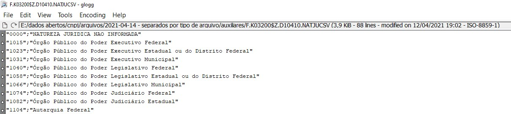
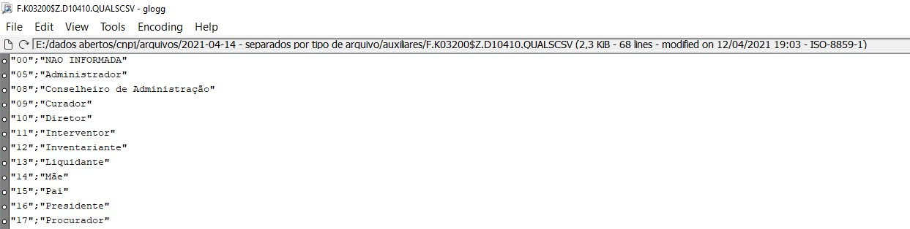

# Open data from Brasil

Leia em outro idioma (Read this in other language):

## Resumo

Este projeto foi feito para explorar os dados abertos do Brasil sobre empresas.

Este projeto seguiu as seguintes etapas:

1. Definir o escopo do projeto e coletar dados
2. Explorar e avaliar os dados
3. Definir o modelo de dados
4. Executar ETL para modelar os dados
5. Descrever e documentar o Projeto

## 1. Definição do escopo do projeto e coleta de dados

### __Escopo do projeto__

Este projeto tem como objetivo final permitir que as pessoas possam fazer análises relacionadas as empresas brasileiras e dar base para tomadas de decisões, com base na concorrência e ou outros fatores observados, como por exemplo: 

- Em que cidade é um bom local para abrir uma empresa?
- Quais são os clientes, cidades ou regiões que é possível explorar?
- Qual o tamanho do mercado disponível?
- Quem são meus clientes, quais empresas eles possuem, existe alguma informação de contato disponível?
- Faço alguma abordagem diferenciada para alguns clientes em função de existir clientes se relacionando entre si?

## 2. Explorar e avaliar os dados

### __Descrição dos conjuntos de dados__

Os conjutos de dados utilizados inicialmente são oriundos do governo brasileiro e disponibilizados de forma aberta.

__Dados Abertos do CNPJ__

**Característica**|**Descrição**|**Status**
-----|:-----:|:-----:
Periodicidade atualização:|mensal
Formato dados:|csv
Origem:|[clique aqui](https://www.gov.br/receitafederal/pt-br/assuntos/orientacao-tributaria/cadastros/consultas/dados-publicos-cnpj)|
Layout:|[clique aqui](https://www.gov.br/receitafederal/pt-br/assuntos/orientacao-tributaria/cadastros/consultas/arquivos/NOVOLAYOUTDOSDADOSABERTOSDOCNPJ.pdf)

 

Arquivos e exemplos:

__Estabelecimentos__

[Dicionário de campos](./assets/docs/database/dictionary.md#estabelecimentos)

 

__Empresas__

[Dicionário de campos](./assets/docs/database/dictionary.md#empresas)

 

__Sócios__

[Dicionário de campos](./assets/docs/database/dictionary.md#sócios)

 

__CNAE - Classificação Nacional de Atividades Econômicas__

[Dicionário de campos](./assets/docs/database/dictionary.md#cnae---classificação-nacional-de-atividades-econômicas)

_Órgão responsável por esta classificação:_ [concla](https://concla.ibge.gov.br)

 

__Natureza Jurídica__

[Dicionário de campos](./assets/docs/database/dictionary.md#natureza-jurídica)

_Órgão responsável por esta classificação:_ [concla](https://concla.ibge.gov.br)

 

__Qualificação do Sócio__

[Dicionário de campos](./assets/docs/database/dictionary.md#qualificação-do-sócio)

 

__Código do Município__

[Dicionário de campos](./assets/docs/database/dictionary.md#código-do-município)

 

__Código do País__

[Dicionário de campos](./assets/docs/database/dictionary.md#código-do-país)

 

__Dados do Simples Nacional__

[Dicionário de campos](./assets/docs/database/dictionary.md#dados-do-simples-nacional)

 

__Motivo Situação Cadastral__

https://receita.economia.gov.br/orientacao/tributaria/cadastros/cadastro-nacional-de-pessoas-juridicas-cnpj/DominiosMotivoSituaoCadastral.csv/view

__Notas__

1. O campo (CNPJ/CPF DO SÓCIO) e (CNPJ/CPF DO REPRESENTANTE) do layout de sócios devem ser descaracterizados conforme a regra abaixo:

- Ocultação de informações pessoais sigilosas como no caso do CPF, o qual deve ser descaracterizado por meio da ocultação dos três primeiros dígitos e dos dois dígitos verificadores, conforme orientação disposta no art. 129 § 2o da Lei no 13.473/2017 (LDO
2018).

2. Campo Ente Federativo Responsável – EFR, no Layout Principal (Dados Cadastrais): 

Deve ser preenchido para os casos de Órgãos e Entidades do grupo de Natureza Jurídica 1XX. Para as demais naturezas, esse atributo fica em branco.

Exemplos de texto que deverão aparecer no arquivo final: 

- UNIÃO; 
- DISTRITO FEDERAL; 
- BAHIA; 

para municípios, exibir também a sigla da UF: 

- SÃO PAULO – SP;
- BELO HORIZONTE – MG;

3. Campo Faixa Etária, no Layout Sócios

Baseada na data de nascimento do CPF de cada sócio, deverá ser criado o valor para o campo Faixa Etária conforme a regra abaixo:

- 1 para os intervalos entre 0 a 12 anos;
- 2 para os intervalos entre 13 a 20 anos;
- 3 para os intervalos entre 21 a 30 anos;
- 4 para os intervalos entre 31 a 40 anos;
- 5 para os intervalos entre 41 a 50 anos;
- 6 para os intervalos entre 51 a 60 anos;
- 7 para os intervalos entre 61 a 70 anos;
- 8 para os intervalos entre 71 a 80 anos; 
- 9 para maiores de 80 anos;
- 0 para não se aplica;

4. O Campo CNAE FISCAL SECUNDÁRIA, no Layout Estabelecimentos:

Deve ser preenchido com cada ocorrência sendo separada por vírgula, para os casos de várias ocorrências.

 

__Dados complementares IBGE__

__Códigos municípios segundo IBGE__

Fonte: ftp://geoftp.ibge.gov.br/organizacao_do_territorio/estrutura_territorial/divisao_territorial/2020/DTB_2020_v2.zip
Disponibilizado em: https://www.ibge.gov.br/explica/codigos-dos-municipios.php

## 3. Definir o modelo de dados

### __O que a aplicação faz__

todo:

Requi

## Requisitos funcionais:

- Transformar do formato de origem para o de destino   
- Permitir criar implementações de transformações de forma customizadas no futuro
    - Por padrão é utilizado um pipeline usando dataframe
- Permitir definir as configurações do spark via:
    - linha de comando (spark-submit)
    - parâmetros de aplicação
- Permitir definir as configurações por formato de leitura/escrita (origem/destino) via:
    - parâmetros de aplicação
- Permitir selecionar o pipeline de transformação de acordo com os parâmetros de origem e destino

# Melhorias futuras

## Inclusão de novos conjuntos de dados

__Dados populacionais__

Coletar dados relacionados a população brasileira para subsidiar análises relacionadas a abertura de empresas ou detecção de oportunidades.

__Informações relacionadas a valores de terrenos e imóveis__

Coletar dados relacionados a preço de compra e venda de imóveis e terrenos para que seja possível subsidiar análises relacionadas a abertura de empresas, detecção de oportunidades e concorrência.

__Reclamações relacionadas as empresas__

Coletar dados relacionados a reclamações abertas ou relatadas por clientes em sites como reclameaqui, procon para pode analisar as empresas por esta perspectiva. Pode medir o nível de satisfação dos clientes.

__Informações climáticas__

Coletar informações relacionadas a temperatura e clima para subisidiar análises de abertura de empresa, detecção de oportunidades e riscos.

__Dados relacionados a força de trabalho disponível__

Dados sobre nível de escolaridade e educacional.

__CNAE - Estrutura detalhada e notas explicativas__

Descreve de forma mais detalhada quais atividades estão enquadradas ou não em cada CNAE. Este dataset pode ser usado para localizar de forma mais precisa as empresas pelas atividades que ela pode ou não exercer. 

Observa-se no PDF um padrão na forma de descrever o quais atividades estão ou não incluídas em cada código o que permite extração de forma programática.	

https://concla.ibge.gov.br/images/concla/downloads/revisao2007/PropCNAE20/CNAE20_NotasExplicativas.pdf

# Referências técnicas

- https://github.com/jonatasemidio/multilanguage-readme-pattern/blob/master/README.md
- https://github.com/tiimgreen/github-cheat-sheet/blob/master/README.md
- https://udacity.github.io/git-styleguide/
- https://shields.io/
- https://tabletomarkdown.com/convert-spreadsheet-to-markdown/
- https://github.com/georgevbsantiago/qsacnpj/
- https://www.kaggle.com/hugomathien/soccer/home
- https://www.w3schools.com/python/python_intro.asp